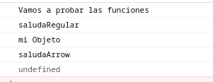
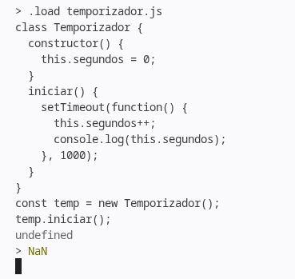

## Arrow Functions
<br>
Carácterísticas

- No requieren del uso de la palabra recervada **function**
- Retorno explicito: Sí la función es de una sola línea se pueden omitir
    - Llaves: {}
    - return
- Parámetros flexibles: sí solo recibe un parámetro se pueden omitie los ()
- Comportamiento de this: 
    - La función no crea su propio contexto **this**
    - En su lugar hereda el para **this** del hambito que la rodea ???

## Segundo ejemplo: persona
**persona.js** usa notacion normal de funcion
```bash
node
> .load persona.js
> persona.saludarTarde();
## persona is undefined
> Hola soyundefines
```
**persona_arrow** usa notacion arrow function
```bash
node
> .load persona_arrow.js
> persona.saludarTarde();
## persona is undefined
> Hola soy Ana
``` 
## Tercer ejemplo: Con fuction callbacks
Simulación de react
boton.js
```bash
node boton.js
Click en: Enviar
arrow_funcions/boton.js:12
callback();  // this es undefined aqui
```
En cambio
boton_arrow.js
```bash
arrow_funcions$ node boton_arrow.js 
Click en: Enviar
```
Acá es como si callback hubiera ejecutado hacerClick() y guardado el valor que pasó la consola
## Ejemplo de cuestionario
se ejecuta en el navegador ( contexto global )
objeto.js
```javascript
const objeto = {
    nombre: 'mi Objeto',
    saludarRegular: function (){
        console.log(this.nombre); 
    },
    saludarArrow: () => {
        console.log(this.nombre);
    }
};
// este hay que usarlo en el navegador
console.log('Vamos a probar las funciones');
console.log('saludaRegular');
objeto.saludarRegular();
console.log('saludaArrow');
objeto.saludarArrow(); 
```
Archivo html para probar el scrip en el navegador
usa_objeto.html
```html
<!DOCTYPE html>
<html lang="en">
<head>
    <meta charset="UTF-8">
    <meta name="viewport" content="width=device-width, initial-scale=1.0">
    <title>Probando Arrow Functions</title>
</head>
<body>
    <script src="objeto.js"></script>
</body>
</html>
```
Para probarlo
```bash
python3 -m http.server 8000
```
El resultado es



no me lo esperaba
## ejemplo temporizador, timeout
temporizador.js
```javascript
class Temporizador {
  constructor() {
    this.segundos = 0;
  }
  iniciar() {
    setTimeout(function() {
      this.segundos++;
      console.log(this.segundos);
    }, 1000);
  }
}
const temp = new Temporizador();
temp.iniciar();
```
ejecucion

sigue
